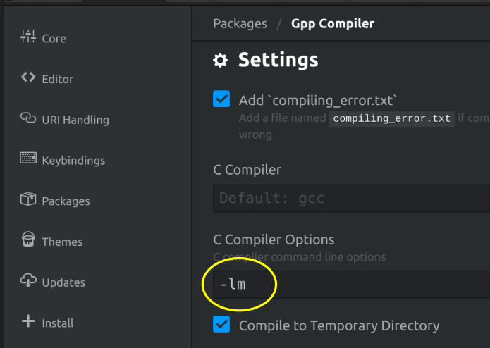

# Ejemplo: algoritmo método de Newton

A continuación escribimos un ejemplo sencillo para ilustrar la implementación en C del método de Newton. Como se puede ver, se utiliza la biblioteca standard `math.h` (para utilizar la función `pow`). Si usas el compilador *gcc*, deberás utilizar la opción `-lm` para enlazar con la biblioteca matemática de C. Si usas el editor *Atom* y el paquete *gpp-compiler*, deberás acceder a la configuración de este paquete y, en la opción *C Compiler Options*, escribir `-lm`.

Por ejemplo, en una terminal puedes escribir:

    gcc -o newton newton.c -lm

La orden anterior generará un programa llamado `newton, que podrás ejecutar en la terminal escribiendo

    ./newton

    #include <stdio.h>
    #include <math.h>

    double f(double x){
        // Aquí definiremos la función con la que queremos trabajar
        // En este caso: $f(x) = x^4 - x^2 -x$.
        return pow(x,4)-pow(x,2)-x;
    }

    double fDerivada(double x) {
        // Aquí definimos la derivada de la función anterior
        return 4*pow(x,3)-2*x-1;
    }

    int main(void) {
        double x;
        int maximaIteracion;
        printf("PRIMER ACERCAMIENTO A LA PROGRAMACIÓN DEL MÉTODO DE NEWTON\n");
        printf("Introduce una primera aproximación del cero de la función: ");
        scanf("%lf",&x);
        printf("Introduce el número máximo de iteraciones a realizar: ");
        scanf("%i",&maximaIteracion);
        int iter = 0;
        // Método de Newton
        while (iter < maximaIteracion) {
            x = x -(f(x)/fDerivada(x));
            iter++;
        }
        printf("\nSolución aproximada: x = %lf\n", x);
        double y = f(x);
        printf("\n¿Es f(x)=0?... f(x)=%lf (más exactamente: %.15g)\n", y, y);
        return 0;
    }
